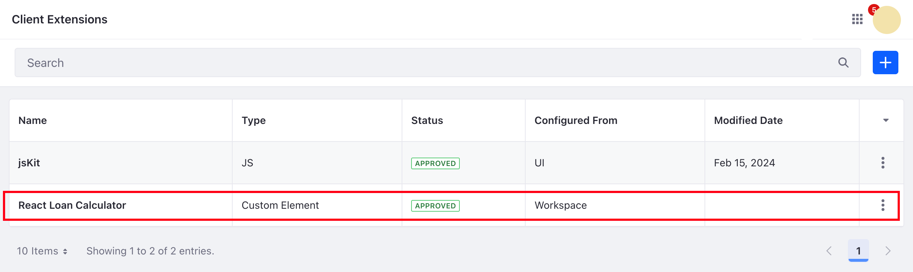

# React Loan Calculator and Form Submission
Example of a multi-step react component that leverages getting and posting Liferay Object data. This component also contains translated content for French, Portuguese, Spanish, and English based on the user's Liferay language settings.


### Expected Use
This resource can be used as a 7.4 Remote App (Custom Element) or a Client Extension service for LXC.

## Create the required Lifeary Objects

1. Create Object named:

    * Label: "Rate"
    * Pural Label: "Rates"
    * Object Name: "Rate"
    * Scope: Company 
    * Note: This object represents the list of rates that the user can choose from.

2. Object Needs the Fields

    | Field  |  Type     | Required  |
    | :---   |   :----:  |  :----:   |
    | Rate   | Decimal   | Yes       |
    | Term   | Integer   | Yes       |

3. Publish the new Rate Object

4. Add a few rate records for the component to use:

    | Rate   | Term      |
    | :---   |   :----:  |
    | 6.75   | 30        |
    | 6.25   | 15        |
    | 5.75   | 10        |
    
5. Set the permissions for each Rate to allow Guest users to view each record. This can be done from the preferences option in the menu by each Rate in the rate list. 

6. Create a second Object named:

    * Label: "Loan Request"
    * Pural Label: "Loan Requests"
    * Object Name: "LoanRequest"
    * Scope: Company
    * Note: This object represents the incoming loan requests that are sent from this component.

7. Object Needs the Fields

    | Field          |  Type       | Required  |
    | :---           |   :----:    |  :----:   |
    | Amount         | LongInteger | No        |
    | Rate           | Decimal     | No        |
    | Term           | Integer     | No        |
    | First Name     | Text        | No        |
    | Last Name      | Text        | No        |
    | Email Address  | Text        | No        |

8. Publish the new Loan Request Object


## Build / Deploy on LXC-SM use Jenkins
1. Upload LXC-SM project (Keep the foloder stucture) and jenkins will automaticly build.
1. After the project is buit, deploy it to UAT/DEV/PRD slot.
1. After the deploy is succeed, you can find this remote app on [Applications] -> [CUSTOM APPS] -> [Client Extensions]


*This will let the Javascript Resources Hosted on Liferay Server in webapps

# Other deploy Method Options

## Build React app on Local machine
Clone repo and run the following:

```
cd liferay/client-extensions/react-loan-calculator
yarn install
npm run build
```

* After the build is done, you can find two files:
```
build/static/js/main.4dc1c35e.js
build/static/css/main.dc4d6ff2.css
```

## Deploy and use
* [Option 1] Hoste this Javascript Resources on Remote Server or LXC Client Extension Service
* [Option 2] Add Javascript Resources to Document Library

## Setup Instruction

Include these in your Remote App or LXC Client Extension Service definition. 

| Field               | Value            |
| :---                | :----            |
| HTML Element Name   | loan-calculator  |
| urls                | path to main.js  |
| cssURLs             | path to main.css |
     
     
* Delivery Method A - Use as separate React App (Make sure to set the CORs Policy to support this approach if on a separate domain) 
* Delivery Method B - Remote App's iFrame (Make sure to set the CORs Policy to support this approach if on a separate domain)


